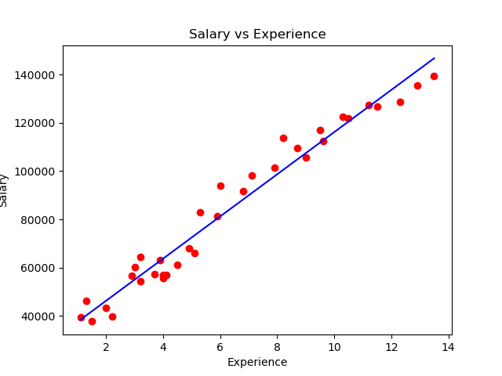

---

# Salary Prediction Project

## Overview
This project is designed to predict the salary of individuals based on their years of experience. It employs a Linear Regression model using Python's scikit-learn library. The project is a classic example of how machine learning can be applied in human resource analytics for salary predictions.

## Getting Started

### Prerequisites
- Python 3.x
- Any Python IDE (like PyCharm, Jupyter Notebook, or VSCode)

### Installation
1. **Clone the Repository:**
   ```
   git clone https://github.com/pramodyasahan/salary-predictor
   ```
2. **Install Required Libraries:**
   - pandas for data manipulation and analysis
   - matplotlib for plotting graphs
   - scikit-learn for the Linear Regression model

   You can install these using pip:
   ```
   pip install pandas matplotlib scikit-learn
   ```
3. **Download the Dataset:** Download the dataset from https://www.kaggle.com/datasets/rsadiq/salary/ and place it in the project directory.

## Project Structure
- `Salary.csv`: The dataset file containing salary data and years of experience.
- `main.py`: The main Python script with data processing, model training, and visualization.

## Running the Project
1. Open the project in your Python IDE.
2. Ensure that the `Salary.csv` dataset is in the correct directory.
3. Run `main.py` to execute the model training and visualization.

## Code Explanation

### Data Processing
- **Loading Dataset:** The `Salary.csv` dataset is loaded into a Pandas DataFrame.
- **Feature Extraction:** The independent variable (Experience) and the dependent variable (Salary) are extracted from the dataset.

### Model Training
- **Linear Regression Model:** A Linear Regression model is created using scikit-learn.
- **Model Fitting:** The model is trained on the dataset to find the best-fit line.

### Visualization

One of the key aspects of the Salary Prediction project is the visualization of the data and the regression model's predictions. This is accomplished using matplotlib, a powerful plotting library in Python.

- **Scatter Plot with Regression Line:** The main output of the project is a scatter plot that displays the actual salaries (in red) against years of experience. Overlaid on this scatter plot is a blue regression line, which represents the salary predictions made by our linear regression model.

- **Insights:** This plot is crucial as it visually demonstrates the relationship between years of experience and salary. It also shows how well the linear regression model fits the data.

Here's an example of what the plot looks like:



This plot was generated using the matplotlib library in Python, and it's a prime example of the project's capabilities in predicting salaries based on experience.

### Results Interpretation
- The scatter plot and the regression line provide insights into the relationship between experience and salary.
- The model can predict the salary of an individual given their years of experience.

## Theoretical Background
- **Linear Regression:** This project uses Linear Regression, a fundamental statistical approach that models the relationship between a dependent variable and one or more independent variables.
- **Data Visualization:** Data is visualized using a scatter plot to represent the actual data points and a line to represent the prediction.

## Contribution
Your contributions to the project are welcome. Feel free to fork the repository, make improvements, and open a pull request.


---

